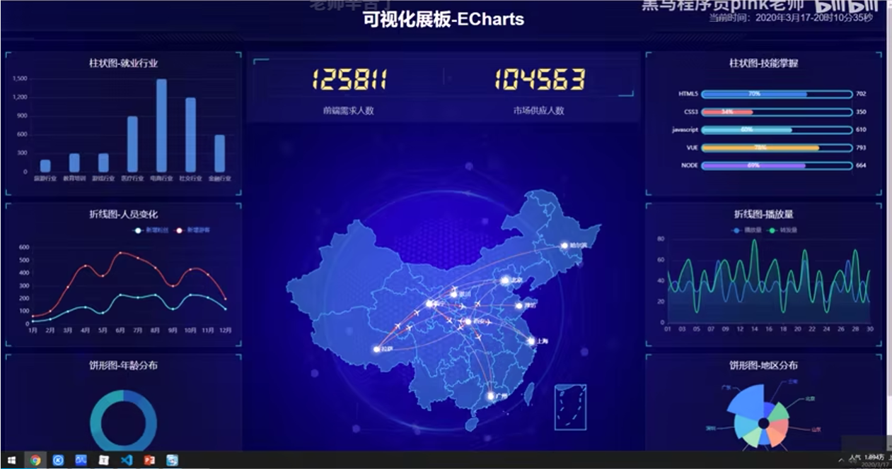

# 数据可视化

什么是数据可视化？

借助图形化手段，清晰的传达与沟通信息。可以把冷冰冰的数据转化成图形。



# 前期准备：

## 创建文件夹


## 插件下载：

1、easy less


创建index.less

ctrl+s自动创建ndex.css

2、cssrem插件下载


改成80

意思是1rem=80px

这个插件自动将1rem转化成80px


## index.html初始化

```
<!DOCTYPE html>
<html lang="en">
<head>
    <meta charset="UTF-8">
    <meta name="viewport" content="width=device-width, initial-scale=1.0">
    <title>数据可视化</title>
    <!-- 导入样式 -->
    <link rel="stylesheet" href="css/index.css">
</head>
<body>
    <div class="box">
    </div>
    <!--引入flexible.js文件，自动改变页面大小，响应页面 -->
    <script src="js/flexible.js"></script>
</body>
</html>
```

## index.css初始化

- body 设置背景图 ，缩放为 100%  ， 行高1.15
- css初始化

```
// css初始化
* {
    margin: 0;
    padding: 0;
    box-sizing: border-box;
}

body{
    background: url(../images/bg.jpg) 
    no-repeat top center;
    line-height: 1.15;
}
```

# 案例适配方案

- 设计稿为1920px

  1. flexible.js 把屏幕分为 24 等份


  2. cssrem 插件的基准值是  80px 

     插件-配置按钮---配置扩展设置--Root Font Size 里面 设置。 

     但是别忘记重启vscode软件保证生效


# 01-header部分

- 高度为100px

- 背景图，在容器内显示

- 缩放比例为 100%

- h1 标题部分   白色  38像素 居中显示  行高为 80像素

- 时间模块 showTime   定位右侧  right 为 30px   行高为 75px  文字颜色为：rgba(255, 255, 255, 0.7)     而文字大小为 20像素 

  ```
  // 格式： 当前时间：2020年3月17-0时54分14秒
  <script>
              var t = null;
              t = setTimeout(time, 1000);//開始运行
              function time() {
                  clearTimeout(t);//清除定时器
                  dt = new Date();
                  var y = dt.getFullYear();
                  var mt = dt.getMonth() + 1;
                  var day = dt.getDate();
                  var h = dt.getHours();//获取时
                  var m = dt.getMinutes();//获取分
                  var s = dt.getSeconds();//获取秒
                  document.querySelector(".showTime").innerHTML = '当前时间：' + y + "年" + mt + "月" + day + "-" + h + "时" + m + "分" + s + "秒";
                  t = setTimeout(time, 1000); //设定定时器，循环运行     
              }
   </script>
  ```

- Header部分html

  ```
   <header>
          <h1>数据可视化-Echarts</h1>
          <div class="showTime"></div>
          <script>
              var t = null
              t = setTimeout(time, 1000)//开始运行时间，1秒
              dt = new Date()//创建date对象
              // 拆分时间
              var y = dt.getFullYear()
              var mt = dt.getMonth() + 1
              var day = dt.getDate()
              var h = dt.getHours()
              var m = dt.getMinutes()
              var s = dt.getSeconds()
              document.querySelector(".showTime").innerHTML = '当前时间：' + y + '年' + mt + "月" + day + "-" + h + "时" + m + "分" + s + "秒"
              t = setTimeout(time, 1000)//设定定时器，循环运行    
          </script>
      </header>
  
  ```

- header部分css样式

  ```
  header{
      position: relative;
      height: 1.25rem;
      background: url(../images/head_bg.png) no-repeat;
      background-size: 100% 100%;
      h1{
          font-size: .475rem;
          color: #fff;
          line-height: 1rem;
          text-align: center;
      }
      .showTime{
          top: 0;
          position: absolute;
          right: .375rem;
          line-height: .9375rem;
          color: rgba(255, 255, 255, 0.7);
          font-size: .25rem;
  
      }
  }
  ```

  

# 02-mainbox主体模块部分

  - 需要一个上左右的10px 的内边距


- column 列容器，分三列，占比 3：5：3

html:

```
    <section class="mainbox">
     	<!-- 左边 -->
        <div class="column">1</div>
        <!-- 中间 -->
        <div class="column">2</div>
        <!-- 右边 -->
        <div class="column">3</div>
    </section>

```

css样式：

```
.mainbox {
    // 最小宽度
    min-width: 1024px;
    max-width: 1920px;
    margin: 0 auto;
    padding: 0.125rem 0.125rem 0;
    display: flex;
    .column {
        flex: 3;
    }
    .column:nth-child(2) {
        flex: 5;
    }
}
```


# 03-公共面板模块 panel 


  - 高度为 310px
  - 1像素的 1px solid rgba(25, 186, 139, 0.17)  边框
  - 有line.jpg 背景图片
  - padding为  上为 0  左右 15px  下为 40px
  - 下外边距是 15px
  - 利用panel  盒子 before 和after 制作上面两个角   大小为 10px  线条为  2px solid #02a6b5
  - 新加一个盒子before 和after   制作下侧两个角  宽度高度为 10px

```
    //左侧 公共盒子样式
    .panel {
        position: relative;
        height: 3.875rem;
        background: url(../images/line.png) rgba(146, 145, 145, 0.04);
        padding: 0 .1875rem .5rem;
        margin-bottom: .1875rem;

        &::before {
            position: absolute;
            top: 0;
            left: 0;
            width: 10px;
            height: 10px;
            border-left: 2px solid #02a6b5;
            border-top: 2px solid #02a6b5;
            content: '';
        }

        &::after {
            position: absolute;
            top: 0;
            right: 0;
            width: 10px;
            height: 10px;
            border-right: 2px solid #02a6b5;
            border-top: 2px solid #02a6b5;
            content: '';
        }

        .panel-footer {
            position: absolute;
            bottom: 0;
            left: 0;
            width: 100%;

            &::before {
                position: absolute;
                // 左下角
                bottom: 0;
                left: 0;
                width: 10px;
                height: 10px;
                border-left: 2px solid #02a6b5;
                border-bottom: 2px solid #02a6b5;
                content: '';
            }

            &::after {
                position: absolute;
                // 右下角
                bottom: 0;
                right: 0;
                width: 10px;
                height: 10px;
                border-right: 2px solid #02a6b5;
                border-bottom: 2px solid #02a6b5;
                content: '';
            }
        }
    }
```

# 04-柱状图bar模板（布局）

  - 标题模块  h2    高度为 48px   文字颜色为白色  文字大小为  20px  

  - 图标内容模块  chart   高度 240px 

  - 以上可以作为panel公共样式部分 

html:

```
            <!-- 左边 -->
            <!-- bar:柱状图 -->
            <div class="panel bar">
                <h2>柱形图-就业行业</h2>
                <div class="chart">图标</div>
                <div class="panel-footer"></div>
            </div>
```

css:

```
  h2{
            height: .6rem;
            line-height: .6rem;
            text-align: center;
            color: #fff;
            font-size: .25rem;
            font-weight: 400;
        }
        .chart{
            height: 3rem;
            // background-color: pink;
        }
```

其他的5个同理


# 05-中间布局


- 上面是no 数字模块
- 下面是map 地图模块

## no 数字模块制作：

1. 数字模块 no  有个背景颜色  rgba(101, 132, 226, 0.1);  有个15像素的内边距

2. 注意中间列 column 有个 左右 10px 下 15px 的外边距

3. no 模块里面上下划分  上面是数字（no-hd)   下面 是 相关文字说明(no-bd)

4. no-hd 数字模块   有一个边框 1px solid rgba(25, 186, 139, 0.17)    

5. no-hd 数字模块 里面分为两个小li  每个小li高度为 80px   文字大小为   70px   颜色为 #ffeb7b   字体是图标字体  electronicFont

6. no-hd 利用 after 和 before制作2个小角，  边框  2px solid #02a6b5  宽度为 30px  高度为 10px

7. 小竖线 给 第一个小li after 就可以  1px宽 背景颜色为 rgba(255, 255, 255, 0.2);     高度 50%  top 25% 即可

8. no-bd 里面也有两个小li  高度为 40px   文字颜色为  rgba(255, 255, 255, 0.7)   文字大小为 18px   上内边距为  10px

   ```
   /* 声明字体*/
   @font-face {
     font-family: electronicFont;
     src: url(../font/DS-DIGIT.TTF);
   }
   ```

## 地图模块制作：

1. 地图模块高度为 810px  里面包含4个盒子  chart 放图表模块      球体盒子  旋转1  旋转2  
2. 球体图片模块 map1    大小为 518px  要加背景图片 因为要缩放100%     定位到最中央    透明度 .3   
3. 旋转1  map 2    大小为 643px 要加背景图片 因为要缩放100%    定位到中央  透明度  .6   做旋转动画   利用z-index压住球体
4. 旋转2  map3  大小为 566px  要加背景图片 因为要缩放100%    定位到中央 旋转动画 注意是逆时针 

## 代码：

html：

```
 <div class="column">
            <!-- 数字no模块 -->
             <div class="no">
                <div class="no-hd">
                    <ul>
                        <li>12340</li>
                        <li>56430</li>
                    </ul>
                </div>
                <div class="no-bd">
                    <ul>
                        <li>前端需求人数</li>
                        <li>市场供应人数</li>
                    </ul>
                </div>
             </div>
             <!-- 地图模块 -->
             <div class="map">
                <!-- 球体 -->
                <div class="map1"></div>
                <!-- 旋转1 -->
                <div class="map2"></div>
                <div class="map3"></div>
                <div class="chart"></div>
             </div>
        </div>
```

css：

```
// 数字模块
.no {
    background: rgba(101, 132, 226, 0.1);
    padding: .1875rem;
    .no-hd {
        position: relative;
        border: 1px solid rgba(25, 186, 139, 0.17);

        &::before {
            position: absolute;
            top: 0;
            left: 0;
            width: 30px;
            height: 10px;
            border-top: 2px solid #02a6b5;
            border-left: 2px solid #02a6b5;
            content: '';
        }
        &::after {
            position: absolute;
            bottom: 0;
            right: 0;
            width: 30px;
            height: 10px;
            border-bottom: 2px solid #02a6b5;
            border-right: 2px solid #02a6b5;
            content: '';
        }
        ul {
            display: flex;
            li {
                position: relative;
                flex: 1;
                line-height: 1rem;
                font-size: 0.875rem;
                font-family: 'electronicFont';
                color: rgb(223, 186, 138);
                text-align: center;
                &::after {
                    content: '';
                    position: absolute;
                    top: 25%;
                    right: 0;
                    height: 50%;
                    width: 1px;
                    background: rgba(255, 255, 255, 0.2);
                }
            }
        }
    }

    .no-bd {
        ul {
            display: flex;

            li {
                flex: 1;
                text-align: center;
                color: rgba(255, 255, 255, 0.7);
                font-size: 0.225rem;
                height: .5rem;
                line-height: .5rem;
                padding-top: .125rem;
            }
        }
    }
}

// 地图模块样式
.map {
    position: relative;
    height: 10.125rem;
    .map1 {
        width: 6.475rem;
        height: 6.475rem;
        // 采用绝对定位，相对于map盒子，居中，上下水平
        position: absolute;
        top: 50%;
        left: 50%;
        transform: translate(-50%, -50%);
        background: url(../images/map.png);
        // 图片大小，水平,垂直都为100%
        background-size: 100% 100%;
        // 透明度
        opacity: .3;
    }
    .map2 {
        position: absolute;
        top: 50%;
        left: 50%;
        transform: translate(-50%, -50%);
        width: 8.0375rem;
        height: 8.0375rem;
        background: url(../images/lbx.png);
        background-size: 100% 100%;
        opacity: 0.6;
        // 调用设置好的旋转对象用animation，参数：对象  时间  匀速   无限循环
        animation: rotate1 15s linear infinite;
    }
    // 旋转动画效果1
    @keyframes rotate1 {

        // 从0度开始
        form {
            // 位置保持不变 从0度开始
            transform: translate(-50%, -50%) rotate(0deg);
        }

        to {
            // 位置保持不变 从360度结束
            transform: translate(-50%, -50%) rotate(360deg);
        }
    }
    .map3 {
        position: absolute;
        top: 50%;
        left: 50%;
        transform: translate(-50%, -50%);
        width: 7.075rem;
        height: 7.075rem;
        background: url(../images/jt.png);

        background-size: 100% 100%;
        // 调用设置好的旋转对象用animation，参数：对象  时间  匀速   无限循环
        animation: rotate2 10s linear infinite;

    }

    // 旋转动画效果2
    @keyframes rotate2 {

        // 从0度开始
        form {
            // 位置保持不变 从0度开始
            transform: translate(-50%, -50%) rotate(0deg);
        }

        to {
            // 位置保持不变 从360度结束
            transform: translate(-50%, -50%) rotate(-360deg);
        }


    }

    .chart{
       position: absolute;
       top: 0;
       left: 0;
       width: 100%;
       height: 10.125rem; 
    //    background-color: pink;
    }
```

# 06-Echart-介绍

常见的数据可视化库：

- D3.js   目前 Web 端评价最高的 Javascript 可视化工具库(入手难)  
- ECharts.js   百度出品的一个开源 Javascript 数据可视化库   
- Highcharts.js  国外的前端数据可视化库，非商用免费，被许多国外大公司所使用  
- AntV  蚂蚁金服全新一代数据可视化解决方案  等等
- Highcharts 和 Echarts 就像是 Office 和 WPS 的关系

> ECharts，一个使用 JavaScript 实现的开源可视化库，可以流畅的运行在 PC 和移动设备上，兼容当前绝大部分浏览器（IE8/9/10/11，Chrome，Firefox，Safari等），底层依赖矢量图形库 [ZRender](https://github.com/ecomfe/zrender)，提供直观，交互丰富，可高度个性化定制的数据可视化图表。

大白话：

- 是一个JS插件
- 性能好可流畅运行PC与移动设备
- 兼容主流浏览器
- 提供很多常用图表，且可**定制**。
  - [折线图](https://www.echartsjs.com/zh/option.html#series-line)、[柱状图](https://www.echartsjs.com/zh/option.html#series-bar)、[散点图](https://www.echartsjs.com/zh/option.html#series-scatter)、[饼图](https://www.echartsjs.com/zh/option.html#series-pie)、[K线图](https://www.echartsjs.com/zh/option.html#series-candlestick)

官网地址：<https://www.echartsjs.com/zh/index.html>

官网地址：：https://echarts.js.cn/zh/index.html#

# 07-Echarts-体验

官方教程：[五分钟上手ECharts](https://www.echartsjs.com/zh/tutorial.html#5 分钟上手 ECharts)

- 下载echarts  https://github.com/apache/incubator-echarts/tree/4.5.0  

使用步骤：

1. 引入echarts 插件文件到html页面中

2. 准备一个具备大小的DOM容器，必须要有宽度和高度

   ```
   <div id="main" style="width: 600px;height:400px;"></div>
   ```

3. 初始化echarts实例对象

   ```
   var myChart = echarts.init(document.getElementById('main'));
   ```

4. 指定配置项和数据(option)

   ```
   var option = {
       xAxis: {
           type: 'category',
           data: ['Mon', 'Tue', 'Wed', 'Thu', 'Fri', 'Sat', 'Sun']
       },
       yAxis: {
           type: 'value'
       },
       series: [{
           data: [820, 932, 901, 934, 1290, 1330, 1320],
           type: 'line'
       }]
   };
   ```

5. 将配置项设置给echarts实例对象

```
myChart.setOption(option);
```


# 08-Echarts-基础配置

这是要求同学们知道以下配置每个模块的主要作用干什么的就可以了

> 需要了解的主要配置：`series` `xAxis` `yAxis` `grid` `tooltip` `title` `legend` `color` 

- series

  - 系列列表。每个系列通过 `type` 决定自己的图表类型。列表里面包含的对象：
    1. name:对象名字
    2. type:对象类型，可选项：line、bar、pie
    3. stack:数据堆叠，同个类目轴上系列配置相同的`stack`值后 后一个系列的值会在前一个系列的值上相加。
    4. data:每条对象的数据
  - 大白话：图标数据，指定什么类型的图标，可以多个图表重叠。
- grid：直角坐标系内绘图网格。 图表大小通过这个控制，比如控制线性图，柱状图
  1. 属性：
     1. left:
     2. right:
     3. buttom：
     4. containLabel:是否显示刻度

- xAxis：直角坐标系 grid 中的 x 轴

  1. boundaryGap: 坐标轴两边留白策略 true，这时候刻度只是作为分隔线，标签和数据点都会在两个刻度之间的带(band)中间
  2. type：坐标轴类型，是值还是类目。可选项：
     1. `'value'` 数值轴，适用于连续数据。
     2. `'category'` 类目轴，适用于离散的类目数据。为该类型时类目数据可自动从 [series.data](https://echarts.apache.org/zh/option.html#series.data) 或 [dataset.source](https://echarts.apache.org/zh/option.html#dataset.source) 中取，或者可通过 [xAxis.data](https://echarts.apache.org/zh/option.html#xAxis.data) 设置类目数据。
     3. `'time'` 时间轴，适用于连续的时序数据，与数值轴相比时间轴带有时间的格式化，在刻度计算上也有所不同，例如会根据跨度的范围来决定使用月，星期，日还是小时范围的刻度。
     4. `'log'` 对数轴。适用于对数数据。对数轴下的堆积柱状图或堆积折线图可能带来很大的视觉误差，并且在一定情况下可能存在非预期效果，应避免使用。
  3. data:数据列表

- yAxis：直角坐标系 grid 中的 y 轴

- title：标题组件

- tooltip：提示框组件

  ​			触发方式trigger:

  - ‘item’触发类型：数据项图形触发，主要在散点图，饼图等无类目轴的图表中使用
  - ‘axis’触发类型：坐标轴触发，主要在柱状图，折线图等会使用类目轴的图表中使用。

- legend：图例组件。series中设置了name值，legend中的data对象可以删掉

- color：调色盘颜色列表,是个数组  color:[ ],

- toolbox:工具箱组件（另存为图片等功能）


# 09- 柱状图图表（两大步骤）

- 官网找到类似实例， 适当分析，并且引入到HTML页面中
- 根据需求定制图表

## １、引入到html页面中

由于太多图表，防止命名时重名，所以将其提取出来放到单独的index.js文件中，采用立即执行函数对其进行编写，在html中导入index.js 即可

```
  <script src="js/index.js"></script>
```

```
// 柱状图1模块
(function() {
  // 实例化对象
  let myChart = echarts.init(document.querySelector(".bar .chart"));
  // 指定配置和数据
  let option = {
    color: ["#3398DB"],
    tooltip: {
      trigger: "axis",
      axisPointer: {
        // 坐标轴指示器，坐标轴触发有效
        type: "shadow" // 默认为直线，可选为：'line' | 'shadow'
      }
    },
    grid: {
      left: "3%",
      right: "4%",
      bottom: "3%",
      containLabel: true
    },
    xAxis: [
      {
        type: "category",
        data: ["Mon", "Tue", "Wed", "Thu", "Fri", "Sat", "Sun"],
        axisTick: {
          alignWithLabel: true
        }
      }
    ],
    yAxis: [
      {
        type: "value"
      }
    ],
    series: [
      {
        name: "直接访问",
        type: "bar",
        barWidth: "60%",
        data: [10, 52, 200, 334, 390, 330, 220]
      }
    ]
  };

  // 把配置给实例对象
  myChart.setOption(option);
})();
```

## ２、根据需求定制

- 修改图表柱形颜色  #2f89cf

- 修改图表大小  top 为 10px   bottom 为  4%    grid决定我们的柱状图的大小

  ```
  color: ["#2f89cf"],
  grid: {
    left: "0%",
    top: "10px",
    right: "0%",
    bottom: "4%",
    containLabel: true
  },
  ```

- X轴相关设置  xAxis

  - 文本颜色设置为   rgba(255,255,255,.6)   字体大小为 12px
  - X轴线的样式 不显示

  ```
     // 设置x轴标签文字样式
    // x轴的文字颜色和大小
          axisLabel: {
            color: "rgba(255,255,255,.6)",
            fontSize: "12"
          },
     //  x轴样式不显示
     axisLine: {
         show: false
         // 如果想要设置单独的线条样式 
         // lineStyle: {
         //    color: "rgba(255,255,255,.1)",
         //    width: 1,
         //    type: "solid"
        }
     }
  ```

  

- Y 轴相关定制

  - 文本颜色设置为   rgba(255,255,255,.6)   字体大小为 12px
  - Y 轴线条样式 更改为  1像素的  rgba(255,255,255,.1) 边框
  - 分隔线的颜色修饰为  1像素的  rgba(255,255,255,.1)  

  ```
  // y 轴文字标签样式
  axisLabel: {
        color: "rgba(255,255,255,.6)",
         fontSize: "12"
  },
   // y轴线条样式
   axisLine: {
        lineStyle: {
           color: "rgba(255,255,255,.1)",
           // width: 1,
           // type: "solid"
        }
  5232},
   // y 轴分隔线样式
  splitLine: {
      lineStyle: {
         color: "rgba(255,255,255,.1)"
       }
  }
  ```

  

- 修改柱形为圆角以及柱子宽度  series 里面设置

  ```
  series: [
        {
          name: "直接访问",
          type: "bar",
          // 修改柱子宽度
          barWidth: "35%",
          data: [10, 52, 200, 334, 390, 330, 220],
          itemStyle: {
            // 修改柱子圆角
            barBorderRadius: 5
          }
        }
      ]
    };
  ```

- 更换对应数据

  ```
  // x轴中更换data数据
   data: [ "旅游行业","教育培训", "游戏行业", "医疗行业", "电商行业", "社交行业", "金融行业" ],
  // series 更换数据
   data: [200, 300, 300, 900, 1500, 1200, 600]
  ```

- 让图表跟随屏幕自适应

```
  window.addEventListener("resize", function() {
    myChart.resize();
  });
```

# 10-柱状图2定制

- 官网找到类似实例， 适当分析，并且引入到HTML页面中
- 根据需求定制图表


## １、引入到html页面中

```
// 柱状图2
(function () {
    // 实例化对象
    var myChart = echarts.init(document.querySelector('.bar2 .chart'))
    // 2、指定配置项和数据
    var option = {
  title: {
    text: 'World Population'
  },
  tooltip: {
    trigger: 'axis',
    axisPointer: {
      type: 'shadow'
    }
  },
  legend: {},
  grid: {
    left: '3%',
    right: '4%',
    bottom: '3%',
    containLabel: true
  },
  xAxis: {
    type: 'value',
    boundaryGap: [0, 0.01]
  },
  yAxis: {
    type: 'category',
    data: ['Brazil', 'Indonesia', 'USA', 'India', 'China', 'World']
  },
  series: [
    {
      name: '2011',
      type: 'bar',
      data: [18203, 23489, 29034, 104970, 131744, 630230]
    },
    {
      name: '2012',
      type: 'bar',
      data: [19325, 23438, 31000, 121594, 134141, 681807]
    }
  ]
}
    // 3、把配置项给实例对象
    myChart.setOption(option)
    // 4、让图表跟着屏幕变化
    window.addEventListener("resize", function () {
        myChart.resize()
    })
})();
```

## 2、根据需求定制图表

需求1： 修改图形大小 grid

```
 // 图标位置
    grid: {
      top: "10%",
      left: "22%",
      bottom: "10%"
    },
```

需求2： 不显示x轴 

```
   xAxis: {
      show: false
    },
```

需求3： y轴相关定制

- 不显示y轴线和相关刻度

```
//不显示y轴线条
axisLine: {
    show: false
        },
// 不显示刻度
axisTick: {
   show: false
},
```

- y轴文字的颜色设置为白色

```
   axisLabel: {
          color: "#fff"
   },
```

需求4： 修改第一组柱子相关样式（条状）

```
name: "条",
// 柱子之间的距离
barCategoryGap: 50,
//柱子的宽度
barWidth: 10,
// 柱子设为圆角
itemStyle: {
    normal: {
      barBorderRadius: 20,       
    }
},
```

- 设置第一组柱子内百分比显示数据

```
// 图形上的文本标签
label: {
    normal: {
         show: true,
         // 图形内显示
         position: "inside",
         // 文字的显示格式 
        //    {c}自动解析为数据
         formatter: "{c}%"
     }
},
```

- 设置第一组柱子不同颜色

```
// 声明颜色数组
var myColor = ["#1089E7", "#F57474", "#56D0E3", "#F8B448", "#8B78F6"];
// 2. 给 itemStyle  里面的color 属性设置一个 返回值函数
  itemStyle: {
          normal: {
            barBorderRadius: 20,  
            // params 传进来的是柱子对象
            console.log(params);
            // dataIndex 是当前柱子的索引号
            return myColor[params.dataIndex];
          }
         
},
```

需求5： 修改第二组柱子的相关配置（框状）

```
  	    name: "框",
        type: "bar",
        barCategoryGap: 50,
        barWidth: 15,
        itemStyle: {
            color: "none",
            borderColor: "#00c1de",
            borderWidth: 3,
            barBorderRadius: 15
        },
        data: [19325, 23438, 31000, 121594, 134141, 681807]
      }
```

需求6： 给y轴添加第二组数据

```
yAxis: [
      {
      type: "category",
      data: ["印尼", "美国", "印度", "中国", "世界人口(万)"],
      // 不显示y轴的线
      axisLine: {
        show: false
      },
      // 不显示刻度
      axisTick: {
        show: false
      },
      // 把刻度标签里面的文字颜色设置为白色
      axisLabel: {
        color: "#fff"
      }
    },
      {
        show: true,
        data: [702, 350, 610, 793, 664],
           // 不显示y轴的线
      axisLine: {
        show: false
      },
      // 不显示刻度
      axisTick: {
        show: false
      },
        axisLabel: {
          textStyle: {
            fontSize: 12,
            color: "#fff"
          }
        }
      }
    ],
```

需求7： 设置两组柱子层叠以及更换数据

```
// 给series  第一个对象里面的 添加 
yAxisIndex: 0,
// 给series  第二个对象里面的 添加 
yAxisIndex: 1,
// series 第一个对象里面的data
data: [70, 34, 60, 78, 69],
// series 第二个对象里面的data
data: [100, 100, 100, 100, 100],
// y轴更换第一个对象更换data数据
data: ["HTML5", "CSS3", "javascript", "VUE", "NODE"],
// y轴更换第二个对象更换data数据
data:[702, 350, 610, 793, 664],
```

## 完整代码

```
// 柱状图2
(function() {
  var myColor = ["#1089E7", "#F57474", "#56D0E3", "#F8B448", "#8B78F6"];
  // 1. 实例化对象
  var myChart = echarts.init(document.querySelector(".bar2 .chart"));
  // 2. 指定配置和数据
  var option = {
    grid: {
      top: "10%",
      left: "22%",
      bottom: "10%"
      // containLabel: true
    },
    // 不显示x轴的相关信息
    xAxis: {
      show: false
    },
    yAxis: [
      {
        type: "category",
        inverse: true,
        data: ["HTML5", "CSS3", "javascript", "VUE", "NODE"],
        // 不显示y轴的线
        axisLine: {
          show: false
        },
        // 不显示刻度
        axisTick: {
          show: false
        },
        // 把刻度标签里面的文字颜色设置为白色
        axisLabel: {
          color: "#fff"
        }
      },
      {
        data: [702, 350, 610, 793, 664],
        inverse: true,
        // 不显示y轴的线
        axisLine: {
          show: false
        },
        // 不显示刻度
        axisTick: {
          show: false
        },
        // 把刻度标签里面的文字颜色设置为白色
        axisLabel: {
          color: "#fff"
        }
      }
    ],
    series: [
      {
        name: "条",
        type: "bar",
        data: [70, 34, 60, 78, 69],
        yAxisIndex: 0,
        // 修改第一组柱子的圆角
        itemStyle: {
          barBorderRadius: 20,
          // 此时的color 可以修改柱子的颜色
          color: function(params) {
            // params 传进来的是柱子对象
            console.log(params);
            // dataIndex 是当前柱子的索引号
            return myColor[params.dataIndex];
          }
        },
        // 柱子之间的距离
        barCategoryGap: 50,
        //柱子的宽度
        barWidth: 10,
        // 显示柱子内的文字
        label: {
          show: true,
          position: "inside",
          // {c} 会自动的解析为 数据  data里面的数据
          formatter: "{c}%"
        }
      },
      {
        name: "框",
        type: "bar",
        barCategoryGap: 50,
        barWidth: 15,
        yAxisIndex: 1,
        data: [100, 100, 100, 100, 100],
        itemStyle: {
          color: "none",
          borderColor: "#00c1de",
          borderWidth: 3,
          barBorderRadius: 15
        }
      }
    ]
  };

  // 3. 把配置给实例对象
  myChart.setOption(option);
})();

```

# 11-折线图1

- 官网找到类似实例， 适当分析，并且引入到HTML页面中
- 根据需求定制图表

## １、引入到html页面中

```
(function () {
 // 1、实例化对象
var myChart = echarts.init(document.querySelector(".line .chart"))
    // 2、指定配置项和数据
var option = {
  title: {
    text: 'Stacked Line'
  },
  tooltip: {
    trigger: 'axis'
  },
  legend: {
    data: ['Email', 'Union Ads', 'Video Ads', 'Direct', 'Search Engine']
  },
  grid: {
    left: '3%',
    right: '4%',
    bottom: '3%',
    containLabel: true
  },
  toolbox: {
    feature: {
      saveAsImage: {}
    }
  },
  xAxis: {
    type: 'category',
    boundaryGap: false,
    data: ['Mon', 'Tue', 'Wed', 'Thu', 'Fri', 'Sat', 'Sun']
  },
  yAxis: {
    type: 'value'
  },
  series: [
    {
      name: 'Email',
      type: 'line',
      stack: 'Total',
      data: [120, 132, 101, 134, 90, 230, 210]
    },
    {
      name: 'Union Ads',
      type: 'line',
      stack: 'Total',
      data: [220, 182, 191, 234, 290, 330, 310]
    },
    {
      name: 'Video Ads',
      type: 'line',
      stack: 'Total',
      data: [150, 232, 201, 154, 190, 330, 410]
    },
    {
      name: 'Direct',
      type: 'line',
      stack: 'Total',
      data: [320, 332, 301, 334, 390, 330, 320]
    },
    {
      name: 'Search Engine',
      type: 'line',
      stack: 'Total',
      data: [820, 932, 901, 934, 1290, 1330, 1320]
    }
  ]
}
 // 3、把配置给实例对象
    myChart.setOption(option)
    // 4、让图表跟着屏幕变化
    window.addEventListener("resize", function () {
        myChart.resize()
}
```

## 2、根据需求定制图表

需求1： 修改折线图大小，显示边框设置颜色：#012f4a，并且显示刻度标签。

```
    // 设置网格样式
    grid: { 
      top: '20%',
      left: '3%',
      right: '4%',
      bottom: '3%',
      show: true,// 显示边框
      borderColor: '#012f4a',// 边框颜色
      containLabel: true // 包含刻度文字在内
    },
```

需求2： 修改图例组件中的文字颜色 #4c9bfd， 距离右侧 right 为 10%

```
 // 图例组件
    legend: {
      textStyle: {
        color: '#4c9bfd' // 图例文字颜色
      },
      right: '10%' // 距离右边10%
    },
```

需求3： x轴相关配置

- 刻度去除
- x轴刻度标签字体颜色：#4c9bfd
- 剔除x坐标轴线颜色（将来使用Y轴分割线)
- 轴两端是不需要内间距 boundaryGap

```
    xAxis: {
      type: 'category',
      data: ["周一", "周二"],
	  axisTick: {
         show: false // 去除刻度线
       },
       axisLabel: {
         color: '#4c9bfd' // 文本颜色
       },
       axisLine: {
         show: false // 去除轴线
       },
       boundaryGap: false  // 去除轴内间距
    },
```

需求4： y轴的定制

- 刻度去除
- 字体颜色：#4c9bfd
- 分割线颜色：#012f4a

```
    yAxis: {
      type: 'value',
      axisTick: {
        show: false  // 去除刻度
      },
      axisLabel: {
        color: '#4c9bfd' // 文字颜色
      },
      splitLine: {
        lineStyle: {
          color: '#012f4a' // 分割线颜色
        }
      }
    },
```

需求5： 两条线形图定制

- 颜色分别：#00f2f1  #ed3f35
- 把折线修饰为圆滑 series 数据中添加 smooth 为 true

```
    color: ['#00f2f1', '#ed3f35'],
	series: [{
      name:'新增粉丝',
      data: [820, 932, 901, 934, 1290, 1330, 1320],
      type: 'line',
      // 折线修饰为圆滑
      smooth: true,
      },{
      name:'新增游客',
      data: [100, 331, 200, 123, 233, 543, 400],
      type: 'line',
      smooth: true,
    }]
```

需求6： 配置数据

```
// x轴的文字
xAxis: {
  type: 'category',
  data: ['1月', '2月', '3月', '4月', '5月', '6月', '7月', '8月', '9月', '10月', '11月', '12月'],
```

```
// 图标数据
    series: [{
      name:'新增粉丝',
      data:  [24, 40, 101, 134, 90, 230, 210, 230, 120, 230, 210, 120],
      type: 'line',
      smooth: true
    },{
      name:'新增游客',
      data: [40, 64, 191, 324, 290, 330, 310, 213, 180, 200, 180, 79],     
      type: 'line',
      smooth: true
      }
    }]
```

需求7： 新增需求  点击 2020年   2021年 数据发生变化

以下是后台送过来数据（ajax请求过来的）

```
 var yearData = [
      {
        year: '2020',  // 年份
        data: [  // 两个数组是因为有两条线
             [24, 40, 101, 134, 90, 230, 210, 230, 120, 230, 210, 120],
             [40, 64, 191, 324, 290, 330, 310, 213, 180, 200, 180, 79]
          ]
      },
      {
        year: '2021',  // 年份
        data: [  // 两个数组是因为有两条线
             [123, 175, 112, 197, 121, 67, 98, 21, 43, 64, 76, 38],
     		[143, 131, 165, 123, 178, 21, 82, 64, 43, 60, 19, 34]
          ]
      }
     ];
```

- tab栏切换事件
- 点击2020按钮   需要把 series 第一个对象里面的data  换成  2020年对象里面data[0] 
- 点击2020按钮   需要把 series 第二个对象里面的data  换成  2020年对象里面data[1] 
- 2021 按钮同样道理

html:

```
  <!-- 折线图 -->
            <div class="panel line">
                <h2>
                    折线图-人员变化
                    <a href="javascript:;">2020</a>
                    <a href="javascript:;">2021</a>
                </h2>
                <div class="chart"></div>
                <div class="panel-footer"></div>
            </div>


<!-- 先引入jquery -->
<script src="js/jquery.js"></script>
```

index.js:

```
// 5、点击切换效果
    $(".line h2").on('click', 'a', function () {
        // alert(1)
        // 点击a后找到对应的yeardata
        var obj = yearData[$(this).index()]
        option.series[0].data = obj.data[0]
        option.series[1].data = obj.data[1]
        // 需要重新设置一下
        myChart.setOption(option)
    })
```

# 12-折线图2 播放量模块制作

- 官网找到类似实例， 适当分析，并且引入到HTML页面中
- 根据需求定制图表

## １、引入到html页面中


## 2、根据需求定制图表

需求1： 更换图例组件文字颜色 rgba(255,255,255,.5)  文字大小为12

# 13-饼状图1

- 官网找到类似实例， 适当分析，并且引入到HTML页面中
- 根据需求定制图表

## １、引入到html页面中

```
(function () {
    // 1、实例化对象
    var myChart = echarts.init(document.querySelector('.pie .chart'))
 // 2、设置配置项和数据
var option = {
  tooltip: {
    trigger: 'item'
  },
  legend: {
    top: '5%',
    left: 'center'
  },
  series: [
    {
      name: 'Access From',
      type: 'pie',
      radius: ['40%', '70%'],
      avoidLabelOverlap: false,
      itemStyle: {
        borderRadius: 10,
        borderColor: '#fff',
        borderWidth: 2
      },
      label: {
        show: false,
        position: 'center'
      },
      labelLine: {
        show: false
      },
      data: [
        { value: 1048, name: 'Search Engine' },
        { value: 735, name: 'Direct' },
        { value: 580, name: 'Email' },
        { value: 484, name: 'Union Ads' },
        { value: 300, name: 'Video Ads' }
      ]
    }
  ]
}
    // 3、把配置项给实例化对象
    myChart.setOption(option)
    // 4、让图表跟着屏幕变化
    window.addEventListener("resize", function () {
        myChart.resize()
    })

})();
```

## 2、根据需求定制图表


# 14-饼状图2

- 官网找到类似实例， 适当分析，并且引入到HTML页面中
- 根据需求定制图表

## １、引入到html页面中

```
(function () {
    // 1、实例化对象
    var myChart = echarts.init(document.querySelector('.pie2 .chart'))
    //2、设置配置项和数据
    var option = {
        tooltip: {
            trigger: 'item'
        },
        visualMap: {
            show: false,
            min: 80,
            max: 600,
            inRange: {
                colorLightness: [0, 1]
            }
        },
        series: [
            {
                name: 'Access From',
                type: 'pie',
                radius: '55%',
                center: ['50%', '50%'],
                data: [
                    { value: 335, name: 'Direct' },
                    { value: 310, name: 'Email' },
                    { value: 274, name: 'Union Ads' },
                    { value: 235, name: 'Video Ads' },
                    { value: 400, name: 'Search Engine' },
                    { value: 300, name: 'Search Engine' }
                ].sort(function (a, b) {
                    return a.value - b.value;
                }),
                roseType: 'radius',
                label: {
                    color: 'rgba(255, 255, 255, 0.3)'
                },
                labelLine: {
                    lineStyle: {
                        color: 'rgba(255, 255, 255, 0.3)'
                    },
                    smooth: 0.2,
                    length: 10,
                    length2: 20
                },
                itemStyle: {
                    color: '#c23531',
                    shadowBlur: 200,
                    shadowColor: 'rgba(0, 0, 0, 0.5)'
                },
                animationType: 'scale',
                animationEasing: 'elasticOut',
                animationDelay: function (idx) {
                    return Math.random() * 200;
                }
            }
        ]
    }
    // 3、把配置项给实例化对象
    myChart.setOption(option)
    // 4、让图表跟着屏幕变化
    window.addEventListener("resize",function(){
        myChart.resize()
    })

})();
```

## 2、根据需求定制图表


# css技巧：

## 1、小盒子在大盒子中，水平垂直居中：

大盒子采用position相对定位

小盒子采用position绝对定位

html：

```
<div class="map">
                <!-- 球体 -->
                <div class="map1"></div>
                <!-- 旋转1 -->
                <div class="map2"></div>
                <div class="map3"></div>
                <div class="chart"></div>
             </div>
```

css：

```
.map {
    position: relative;
    height: 10.125rem;
    .map1 {
        width: 6.475rem;
        height: 6.475rem;
        // 采用绝对定位，相对于map盒子，居中，上下水平
        position: absolute;
        top: 50%;
        left: 50%;
        transform: translate(-50%, -50%);
        background: url(../images/map.png);
        // 图片大小，水平,垂直都为100%
        background-size: 100% 100%;
        // 透明度
        opacity: .3;
    }
}
```

